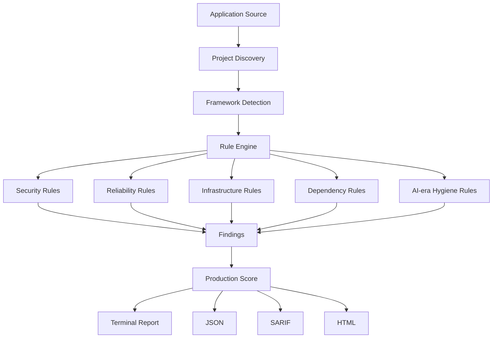

# VibeCoder → Production Checker

AI can write your application in minutes.

Production Checker tells you what it forgot.

Scan AI-generated applications for security, reliability, configuration, infrastructure, and production-readiness issues before deployment.

```bash
npx production-check
```

If the package has not yet been published, run the local CLI from a repository checkout with `node dist/cli.js .`.

```text
Production Checker
──────────────────────────────────────

Project: /path/to/app
Detected: TypeScript, Next.js
Files analyzed: 213
Dependencies detected: 52

Production Score: 84 / 100 — Mostly Ready

Security               92
Reliability            78
Configuration          84
Infrastructure         71
Dependencies           96

Findings (12)

HIGH     Hardcoded secret detected
HIGH     Database port exposed to host
MEDIUM   Permissive CORS configuration
MEDIUM   No obvious rate limiting on authentication endpoints

Scan complete in 0.21s
```

## Why it exists

AI coding tools are excellent at making software work locally. That is not the same as making it safe and operable in production. Production Checker focuses on the gap between a working demo and a deployable application: exposed credentials, permissive runtime settings, unsafe infrastructure, placeholder implementations, and missing operational controls.

This is not an ESLint replacement. It does not lint style or infer every possible bug. It answers one practical question:

> Before putting this application on a VPS, cloud platform, or production server, what did the coding agent forget?

## Features

- Project, language, framework, and package-manager discovery
- Static security checks for secrets, CORS, SQL construction, shell commands, SSRF, cookies, and rate limiting
- Docker and Compose checks for root users, privileged mode, host networking, mutable tags, exposed databases, and health checks
- Reliability checks for exposed stack traces and ignored errors
- Environment and debug-mode configuration checks
- Dependency lockfile analysis
- AI-era hygiene checks for placeholder implementations and sensitive logging
- Explainable production score
- Terminal, JSON, Markdown, SARIF, and self-contained HTML reports
- CI mode with severity-based exit codes
- Configuration, rule suppression, and evidence-based findings
- Fully offline scanner; source is never uploaded

## Installation

```bash
npm install -g production-check
```

Requires Node.js 20 or newer on macOS, Linux, or Windows.

## Quick start

```bash
production-check .
production-check packages/api
production-check . --workspace packages/api
production-check . --workspaces
production-check --format json --output report.json
production-check --format sarif --output report.sarif
production-check --html report.html
production-check --quiet
production-check --no-color
production-check explain SEC-001
production-check explain SEC-001 --find
production-check score
```

Local development:

```bash
node dist/cli.js tests/fixtures/insecure-node-app
```

## Supported checks

| Category | Examples |
|---|---|
| Security | Hardcoded credentials, tracked `.env` files, wildcard CORS, unsafe SQL, command construction, SSRF, insecure cookies, missing visible rate limiting |
| Reliability | Stack traces returned to clients, ignored catch blocks |
| Configuration | Development/debug settings, missing environment validation |
| Infrastructure | Docker root user, privileged containers, Docker socket, host networking, `latest` tags, database port exposure, missing health checks |
| Dependencies | Missing lockfiles |
| Performance | Synchronous filesystem I/O in likely request handlers |
| Production hygiene | Placeholder implementations, suspicious TODOs, sensitive logging |

Production Checker uses evidence and confidence rather than claiming certainty. Static analysis cannot prove authorization correctness, network topology, or every runtime control.

## Framework and language support

Strong rule coverage is implemented for JavaScript and TypeScript web services, including Express, Fastify, NestJS, React, Vite, and Next.js.

Python and PHP projects receive project discovery and a practical subset of production-readiness checks. Laravel, Django, Rails, and Spring are detected, but Production Checker does not claim framework-specific deep analysis for them yet. See [docs/supported-frameworks.md](docs/supported-frameworks.md).

## Scoring

Each category starts at 100. Findings subtract fixed, documented penalties: critical 45, high 22, medium 9, low 3, and info 0. Category penalties are capped at 75 so a project can always recover through other practices. The overall score is the average of applicable category scores.

| Range | Level |
|---:|---|
| 90–100 | Production Ready |
| 80–89 | Mostly Ready |
| 70–79 | Needs Attention |
| 50–69 | High Risk |
| 0–49 | Not Ready |

Run `production-check score` for counts and category explanations. Full methodology: [docs/scoring.md](docs/scoring.md).

## CI

```bash
production-check --ci --fail-on high
```

`--ci` prints concise machine-readable lines and exits non-zero when a finding meets the configured threshold. `failOn` can also be set in `.production-check.json`.

### GitHub Actions

After publishing the action repository under a namespace you own, use:

```yaml
name: Production Check

on:
  pull_request:

jobs:
  production-check:
    runs-on: ubuntu-latest
    steps:
      - uses: actions/checkout@v4
      - uses: your-namespace/production-check-action@v1
        with:
          path: .
          fail-on: high
```

The local action manifest is in [`action/action.yml`](action/action.yml). Do not publish it under the placeholder `vibecoder` namespace without ownership. See [docs/github-actions.md](docs/github-actions.md).

## Reports

```bash
production-check --format json
production-check --format markdown --output report.md
production-check --format sarif --output report.sarif
production-check --html report.html
```

SARIF uses the SARIF 2.1.0 schema and is suitable for GitHub code scanning. JSON is a complete `ScanResult` object. HTML is self-contained and works offline.

## Configuration

Initialize a recommended file:

```bash
production-check init
```

Create `.production-check.json`:

```json
{
  "extends": "recommended",
  "ignore": {
    "SEC-009": "Development-only test credential"
  },
  "rules": {
    "AI-001": "off"
  },
  "severity": {
    "SEC-003": "high"
  },
  "exclude": ["generated"],
  "failOn": "high"
}
```

Inline suppression:

```ts
const apiKey = process.env.API_KEY; // production-check-ignore SEC-001
```

Prefer configuration suppression with a documented reason. See [docs/configuration.md](docs/configuration.md) and [docs/false-positives.md](docs/false-positives.md).

## Security model

- The scanner does not execute project code.
- It does not run `npm install`, `npm run`, `make`, or project scripts.
- It reads source files using Node filesystem APIs and does not follow symlinks outside the project.
- It skips binary and oversized files.
- It parses YAML safely with the `yaml` parser.
- It never uploads source code or sends data to external services.
- Secret evidence is always redacted in reports.

## Architecture



## Roadmap

- **v0.1:** CLI scanner, core security and infrastructure rules, production hygiene, JSON/Markdown/SARIF, Docker scanning
- **v0.2:** More frameworks and languages, official published GitHub Action, richer dependency intelligence
- **v0.3:** Kubernetes and cloud configuration analysis, optional explicit AI-assisted review
- **v1.0:** Plugin system, team configuration, larger rule ecosystem

Optional AI review will always require explicit opt-in, clear data disclosure, and secret redaction.

## Contributing

See [CONTRIBUTING.md](CONTRIBUTING.md), [docs/contributing-rules.md](docs/contributing-rules.md), and [SECURITY.md](SECURITY.md). All contributors follow [CODE_OF_CONDUCT.md](CODE_OF_CONDUCT.md).

## License

MIT
